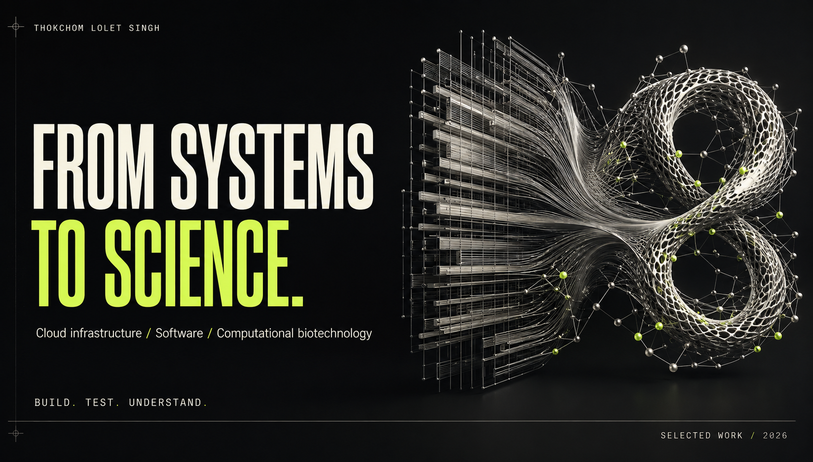
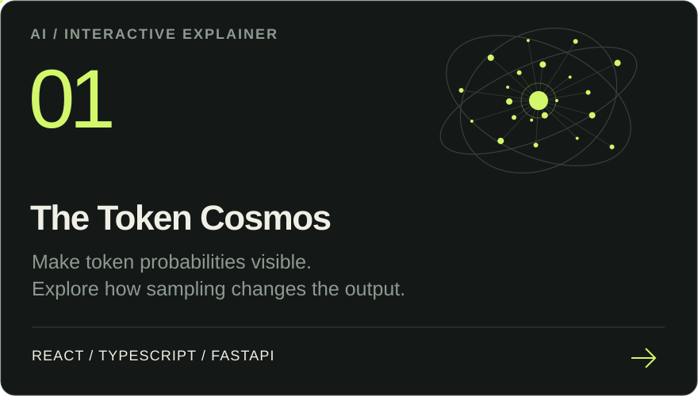
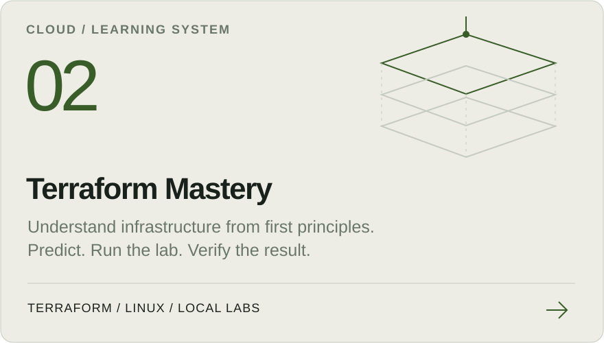
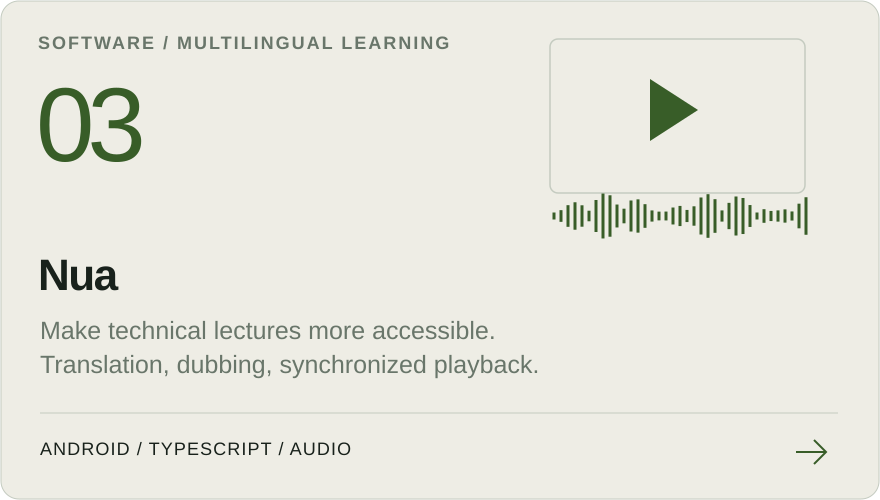
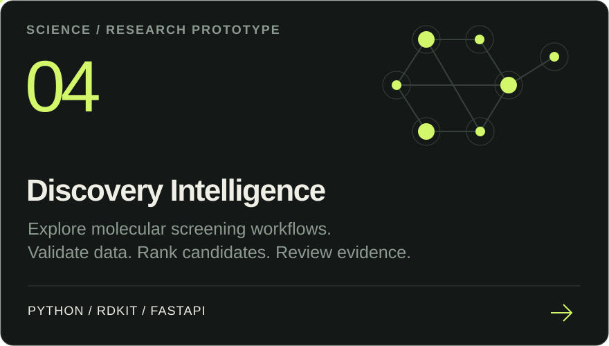
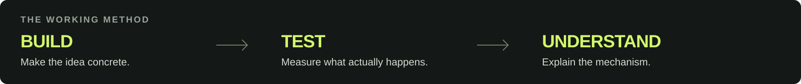

  

  <a href="https://lolet-observatory.lolet.chatgpt.site"><b>ENTER THE OBSERVATORY ↗</b></a> &nbsp; / &nbsp;
  <a href="#selected-work"><b>EXPLORE THE WORK</b></a> &nbsp; / &nbsp;
  <a href="https://thokchomlolet03-cpu.github.io/my-tech-blog/"><b>READ THE NOTES</b></a> &nbsp; / &nbsp;
  <a href="https://www.linkedin.com/in/thokchom-lolet-singh-b77341b2/"><b>LET'S CONNECT ↗</b></a>

 

I'm **Lolet**. I build software for learning and research while developing practical skills in cloud infrastructure, Linux, and networking. My long-term direction is computational biotechnology: reliable systems as a foundation for reproducible science.

## Selected work

Four ways I explore that direction. **Each card opens the source.**

  <a href="https://github.com/thokchomlolet03-cpu/the-token-cosmos"><picture><source media="(max-width: 640px)" srcset="./assets/cosmos-mobile.svg"></picture></a>
  <a href="https://github.com/thokchomlolet03-cpu/terraform-mastery"><picture><source media="(max-width: 640px)" srcset="./assets/terraform-mobile.svg"></picture></a>

  <a href="https://github.com/thokchomlolet03-cpu/Nua"><picture><source media="(max-width: 640px)" srcset="./assets/nua-mobile.svg"></picture></a>
  <a href="https://github.com/thokchomlolet03-cpu/discovery_intelligence_system"><picture><source media="(max-width: 640px)" srcset="./assets/discovery-mobile.svg"></picture></a>

 

<picture><source media="(max-width: 640px)" srcset="./assets/method-mobile.svg"></picture>

 

## The longer arc

**[Mangal BioTech ↗](https://github.com/thokchomlolet03-cpu/mangal-biotech)** 
A simulated-company framework for my systems and research-data portfolio. The public repository establishes how assignments should document requirements, architecture, tests, costs, and recovery.

**[Longevity Research Journey ↗](https://thokchomlolet03-cpu.github.io/longevity-research-journey/)** 
A public record of study, projects, evidence, and changes of mind along the path toward computational longevity research.

<b>Technical focus & research boundaries</b>

 

- **Systems:** Linux, networking, Terraform, Docker, AWS, and Google Cloud.
- **Software:** Python, TypeScript, React, Astro, and FastAPI.
- **Exploratory research:** [Universal Inverse Design](https://github.com/thokchomlolet03-cpu/universal-inverse-design) investigates biomedical knowledge graphs and candidate-generation workflows.
- **Evidence:** Learning projects, demonstration data, simulations, and research prototypes are identified as such. Generated candidates and model scores do not establish biological efficacy or validated therapies. The Token Cosmos distinguishes synthetic demonstration candidates from model output.

 

**Open to IT support, cloud infrastructure, and software opportunities in the UAE and remote.** 
[Connect on LinkedIn ↗](https://www.linkedin.com/in/thokchom-lolet-singh-b77341b2/) · [Read Friction Hunter ↗](https://thokchomlolet03-cpu.github.io/my-tech-blog/)

 

